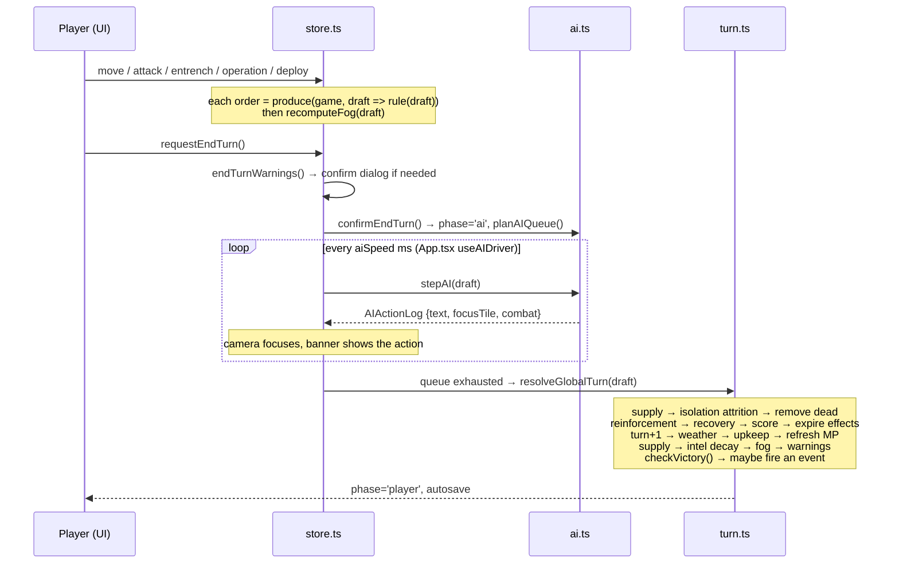

# THEATRE: BLACK EARTH — Introduction & Codebase Overview

An orientation document for anyone (human or agent) picking up this repository.
The [README](../README.md) explains the game to a *player*; the
[changelog](changelog.md) records what was built; the
[v1 briefing](archive/v1-briefing.md) is the original product spec. **This document
explains the codebase to a developer.**

---

## 1. What this is

A self-contained, single-player, turn-based **operational strategy game** that
runs entirely in the browser. No backend, no accounts, no network calls at
runtime (fonts are bundled, audio is synthesised, and the only images are the
locally-served HUD material kit in `public/ui/`).
Saves live in `localStorage`.

The scenario — *"Black Earth, Spring 2025"* — is a deliberately simplified
**designed** scenario set during the war in Ukraine. It is not a reproduction
of live battlefield conditions or real orders of battle. Casualties are
abstracted into strength / morale / readiness / war-support numbers, and the
treatment is intentionally restrained and non-triumphalist. That editorial
stance is a design constraint, not decoration — it shapes the combat model
(degradation and retreat, not annihilation) and the UI copy.

| | |
| --- | --- |
| **Version** | 0.2.0 — v1 vertical slice + the full [v2 presentation release](plans/v2-vision.md) (phases A–F) |
| **Stack** | Vite 5 · React 18 · TypeScript 5.6 (strict) · React Three Fiber / three 0.170 · @react-three/postprocessing + n8ao · Zustand + immer · vitest |
| **Health** | `tsc --noEmit` clean · vitest rule tests (core + combat) · golden-image harness byte-stable |
| **Scenario** | 48 × 36 geodata-derived hex grid (~26 km hexes) → ~890 land tiles · 52 cities · 34 UA / 34 RU formations · 36-turn campaign |
| **Geodata** | Terrain/rivers/roads/cities from Copernicus DEM + ESA WorldCover + Natural Earth via `scripts/geo/build-scenario.mjs`; front line and OOB remain designed |

```bash
npm install
npm run dev      # dev server (playtest/golden scripts expect --port 5199)
npm run build    # tsc && vite build → dist/  (~550 KB gzipped)
npm test         # 16 vitest rule tests
node scripts/geo/build-scenario.mjs   # regenerate the scenario from geodata
```

No GitHub Actions — local `tsc` / `npm test` / playtest only. Do not add
`.github/workflows`.

---

## 2. The one architectural idea

Everything follows from a single rule:

> **The simulation is a set of pure functions over one JSON-serializable
> `GameState`. Rendering only ever reads it.**

```
                 ┌──────────────────────────────────────────┐
   pure ─────►   │  src/game/rules/*   (pure functions)     │
                 │  movement · combat · supply · fog · ops   │
                 │  events · weather · victory · turn        │
                 └────────────────────┬─────────────────────┘
                                      │ applied via immer
                 ┌────────────────────▼─────────────────────┐
   state ────►   │  src/game/state/store.ts  (Zustand)      │
                 │  thin dispatcher + transient UI state     │
                 └────────────────────┬─────────────────────┘
                          reads only  │
                 ┌────────────────────▼─────────────────────┐
   view  ────►   │  src/map/*  (R3F scene)   src/ui/*  (HUD)│
                 └──────────────────────────────────────────┘
```

Three consequences worth internalising before you edit anything:

1. **No classes, no closures, no `Date`/`Math.random` inside the simulation.**
   The RNG state is a *number* stored in `GameState.rngState`
   ([`src/game/rng.ts:4`](../src/game/rng.ts) — mulberry32), and every draw
   returns `{ value, next }` so the caller writes `next` back into the state.
   This is why saves replay identically and why combat is reproducible.
2. **The store never contains rules.** [`store.ts`](../src/game/state/store.ts)
   is ~455 lines of `produce(game, draft => ruleFunction(draft, ...))`. If you
   find yourself writing game logic there, it belongs in `src/game/rules/`.
3. **The whole game is testable headlessly.** `core.test.ts` runs ten complete
   turns — player orders, AI phase, global resolution — with no DOM, no WebGL,
   no mocks.

---

## 3. Repository map

```
src/
  App.tsx              app shell: screen routing, AI-turn driver, hotkeys, audio wiring
  main.tsx             React root

  game/                ── THE SIMULATION (no React, no three.js) ──
    types.ts           every simulation type; GameState lives here
    hex.ts             odd-r offset / pointy-top hex math + world layout
    rng.ts             mulberry32, state-passing style
    data/
      defs.ts          unit / terrain / weather / operation stat tables
      events.ts        10 authored decision events
    scenarios/
      blackEarth2025.ts  ASCII map layers + city/river/road/unit lists
      build.ts           compiles scenario → GameState, validates hard
    rules/
      movement.ts      Dijkstra over MP, zones of control, river costs
      combat.ts        shared power model for preview AND resolution
      supply.ts        budget flood-fill from national sources
      fog.ts           visibility + decaying intel "ghosts"
      ops.ts           six command-point strategic operations
      events.ts        weighted seeded event selection + effects
      weather.ts       seeded monthly weather calendar
      victory.ts       decisive / war-support / turn-limit adjudication
      turn.ts          global resolution; reinforcement, recovery, upkeep
    ai/ai.ts           heuristic opponent, executed one visible step at a time
    state/
      store.ts         Zustand dispatcher + transient UI state
      save.ts          versioned localStorage snapshots
    __tests__/
      core.test.ts     16 rule tests (always run)
      balance.test.ts  AI-vs-AI full campaign (opt-in via BALANCE=1)

  assets/              ── PROCEDURAL MINIATURES (models are code) ──
    parts.ts           coloured geometry primitives (vertex colours)
    vehicles.ts        archetypal MBT / IFV / gun / MRAP / truck / figures
    units.ts           miniature composition: strength→element count,
                       supply→truck, earthworks by entrenchment

  map/                 ── R3F SCENE (consumes state only) ──
    MapScene.tsx       Canvas, sun (turn-driven drift), layer composition
    terrain/           continuous displaced mesh + painted albedo (strip
                       fields, road decals), per-hex tint washes, parchment
                       political renderer, sea shader, river-course ribbons
    postfx/            SSAO · bloom · per-weather grade · vignette
    Presentation.tsx   supply flow lines · battle wear · combat moment ·
                       city landmarks
    Units.tsx          mid-zoom machines + standards; counters at theatre height (Tab)
    Frontline/Decorations/Overlays/Weather · CameraRig.tsx
    palette.ts · textures.ts (counters, standards, labels)
    data/terrainData.ts  generated heightfield + land-cover fractions

  ui/                  ── HUD (map-table design system) ──
    TopBar (milled instrument strip) · Outliner (sector week-runner) · CommandBar (selected only)
    Journal / VictoryClock / SidePanel on demand · TurnCard
    Modals (briefing events) · Notifications · icons.tsx
    AIOverlay · Tutorial · MainMenu (live-map backdrop) · AssetsView (#assets)

  audio/audio.ts       procedural WebAudio + weather beds + map-table foley

scripts/
  geo/                 build-time geodata pipeline (see §«Ground truth»)
  playtest.mjs         drives real Chrome through a turn via window.__TBE_DEBUG__
  golden.mjs           golden-image visual regression (--update to bless)
  screenshot.mjs       visual smoke test
```

---

## 4. Anatomy of a turn

The turn loop is the spine of the whole program. Follow it once and the
codebase opens up.



Key entry points:

| Step | Function |
| --- | --- |
| Order dispatch | [`store.ts`](../src/game/state/store.ts) `orderMove` / `orderAttack` / `applyOperationAt` |
| AI queue planning | [`ai.ts:28`](../src/game/ai/ai.ts) `planAIQueue` — artillery first, then units nearest the enemy |
| AI single step | [`ai.ts:339`](../src/game/ai/ai.ts) `stepAI` |
| AI ticking | [`App.tsx:24`](../src/App.tsx) `useAIDriver` — a `setInterval` at `aiSpeed` |
| World resolution | [`turn.ts:124`](../src/game/rules/turn.ts) `resolveGlobalTurn` |

**Why the AI is stepwise.** `stepAI` executes exactly one queue entry per call
and returns an `AIActionLog`. That's what makes the enemy turn *watchable* —
camera focus, action banner, skip button — without any separate presentation or
replay layer. The AI's `aiQueue`/`aiIndex` live in `GameState`, so a save taken
mid-AI-turn is coherent.

---

## 5. Subsystem tour

### Hex grid — [`hex.ts`](../src/game/hex.ts)
Odd-r offset, pointy-top. Tiles are keyed `"x,y"` strings (`TileId`). Neighbour
offsets differ by row parity (`EVEN_NEIGHBORS` / `ODD_NEIGHBORS`, `hex.ts:8`) —
**this parity split is the source of the classic bug in §7.** Offset→axial
conversion is used only for `hexDistance`. `sharedEdge()` returns the midpoint
and direction of the boundary between two tiles, which is how rivers and the
frontline ribbon are drawn along hex *edges* rather than tile centres.

### Scenario & builder — [`blackEarth2025.ts`](../src/game/scenarios/blackEarth2025.ts) → [`build.ts`](../src/game/scenarios/build.ts)
The map is **data, not code**: three 48-char × 36-row ASCII layers (terrain,
starting control, elevation) plus declarative feature lists — cities, river bank
chains, bridges, road/rail corridors, unit placements, faction setup. Both this
module and `map/data/terrainData.ts` are **generated** by
`scripts/geo/build-scenario.mjs` — change the pipeline inputs, not the outputs.

`buildInitialState()` compiles that into a `GameState` and **throws on any
authoring error**: wrong row length, land tile with no controller, city on
water, unit on enemy-controlled ground, two units stacked, non-adjacent river
bank step, bridge not on a river edge, non-contiguous corridor. Authoring
mistakes fail at startup instead of quietly corrupting a campaign. A second
scenario would need no engine changes — only a new data module.

### Movement & zones of control — [`movement.ts`](../src/game/rules/movement.ts)
`reachableTiles()` is a Dijkstra over movement points. Cost = terrain base
(roads/rail flatten to 1), + weather friction on off-road tiles, + 2 for a
river edge (+0.5 at a bridge), + 1 for entering an enemy ZOC. The crucial line
is `movement.ts:103`: a tile inside enemy ZOC is *recorded but not expanded
from*, so movement stops on contact. No stacking — occupied tiles simply return
`null` cost. `applyMove()` captures every tile along the path, not just the
destination, and zeroes entrenchment.

### Combat — [`combat.ts`](../src/game/rules/combat.ts)
`attackPower()` / `defensePower()` build a power figure **and** a list of
labelled `CombatFactor`s. The preview and the resolution call the *same*
functions, so the preview is honest by construction. Fortune is an explicit
**2d6 per side**: the attack roll scales damage given, the defence roll
scales damage taken (`fortuneFrom2d6` — 7 → ×1.00, 2 → ×0.70, 12 → ×1.30).
The after-action report shows the odds, before/after strength, and a one-line verdict.

Factors modelled: condition (readiness × morale), supply state, unit-vs-terrain
tables, weather, river assault (×0.7) or contested bridge (×0.88), adjacent
artillery support, concentric pressure from flanking formations, close-support
operation, veterancy, disorganisation; and defensively: terrain, settlement
bonus, entrenchment offset by attacker `breakthrough`, fortification.

Outcomes are **degradation, not annihilation**. A defender that must retreat
looks for an adjacent friendly, unoccupied, non-attacker tile; if none exists it
takes severe extra losses and may be destroyed — which is exactly how
encirclement kills.

### Supply — [`supply.ts`](../src/game/rules/supply.ts)
A **max-first Dijkstra** where the "distance" is a depleting budget
(`SUPPLY_BUDGET = 16`) flooding out from cities flagged `supplySource`. Rail
costs 0.5, road 0.75, raw terrain 1–2.5, so supply reaches further along
infrastructure. Friendly hubs *raise* the budget back to `HUB_RECHARGE = 12`
mid-flood, behaving like depots.

The single most consequential line is the controller check at `supply.ts:52`:
supply only crosses **friendly-controlled** tiles. Cut a corridor by taking one
tile and the entire supply map re-derives. Encirclement is nowhere special-cased
— it is an emergent property of that one condition. Levels map to five discrete
states (`full → supplied → strained → low → isolated`) which scale attack,
movement and recovery; two consecutive isolated turns start attrition.

### Fog of war — [`fog.ts`](../src/game/rules/fog.ts)
Terrain, cities and territorial control are **always** visible; fog hides enemy
*information* only. Visibility comes from friendly unit vision radii (reduced by
weather), a 1-hex ring around friendly cities, and active recon-sweep effects.
Enemy formations seen this turn are recorded at intel level 4; unobserved ones
persist as ghosts that `decayIntel()` degrades by age — full → strength unknown
(2 turns) → type unknown (4 turns) → forgotten (6 turns).

### Operations, events, weather
Six command-point operations with per-faction costs and cooldowns
([`ops.ts`](../src/game/rules/ops.ts) + `OPERATION_DEFS` in
[`defs.ts`](../src/game/data/defs.ts)) stand in for air power, drones, fires and
engineering. Ten authored decision events fire on weighted seeded selection
([`data/events.ts`](../src/game/data/events.ts)). Weather is a seeded monthly
calendar affecting movement, attack, recon, recovery and air support.

### Victory — [`victory.ts`](../src/game/rules/victory.ts)
Checked once per turn after global resolution. Early endings: holding both
decisive cities (UA → Melitopol + Mariupol; RU → Kharkiv + Zaporizhzhia), enemy
war support ≤ 8, or an army destroyed. Otherwise at turn 36 a campaign score
decides operational victory / stalemate / defeat. Score accrues from **VP change
relative to the starting position**, so the asymmetric map doesn't bias it.

### AI — [`ai.ts`](../src/game/ai/ai.ts)
A transparent heuristic playing by the same rules, with a fixed priority ladder
per unit: (1) pull back and reconstitute below 35 % strength, (2) artillery
bombards the most entrenched adjacent target and displaces if contacted,
(3) evaluate attacks using the *real* `computePreview` with bonuses for city
value / weak / unsupplied targets and a river-assault penalty, (4) cover a
threatened friendly city, (5) march toward the best value-over-distance
objective, (6) hold. Plus an ops step and a reserve-commitment step. It does
**not** honour fog of war (documented limitation).

### Rendering — `src/map/` (v2)
`MapScene.tsx` owns the Canvas and composes layers. The land is ONE displaced,
lit mesh (`terrain/TerrainMesh.tsx`): a painted albedo canvas (strip-field
patchwork, land-cover fields from the geodata fractions, road/rail decals)
modulated by a per-hex RGBA tint texture (control wash, fog, map modes,
off-map fade) with a GLSL hex seam whose opacity follows selection and camera
height. Picking is world-position → hex inverse math. Units render as
procedural miniatures (element count = strength) with compact standards,
crossfading to the v1 counter plates past a zoom breakpoint (`Tab` forces
counters). Political mode is a genuinely different renderer — parchment,
flat washes, graticule — reached by a ~400 ms material cross-fade; Supply
animates the flood fill as dashed flow lines. A postprocessing chain (SSAO,
restrained bloom, per-weather grade, vignette) and turn-driven sun drift
carry the light. IMPORTANT colour-space rule: DataTextures tagged sRGB must
be written with `convertLinearToSRGB()` bytes or every wash double-darkens.

### Saves — [`save.ts`](../src/game/state/save.ts)
`JSON.stringify(GameState)` into `localStorage`, wrapped in a header with
`SAVE_VERSION`. A version mismatch returns `null` — an incompatible save is
ignored rather than half-loaded. One autosave (written every turn) plus three
manual slots.

---

## 6. Invariants you must not break

1. **`GameState` stays JSON-serializable.** No `Map`, `Set`, `Date`, class
   instances or functions. Note the deliberate `riverEdges: string[]` /
   `visibleTiles: TileId[]` rather than `Set`s.
2. **No `Math.random()` or `Date.now()` in `src/game/`.** Draw from
   `state.rngState` and write `next` back, or determinism and the save/replay
   guarantee break silently.
3. **River banks must be hex-adjacent "ladders".** Rivers live on *edges*,
   generated from every adjacent (bankA, bankB) pair. A step like
   `(10,4) → (11,5)` looks contiguous in column/row arithmetic but is **not**
   adjacent in odd-r, leaving a vertex hole units cross dry. This actually
   happened: the RU AI drove a tank division through such a gap and took Dnipro
   on turn 1. `assertAdjacent()` in `build.ts` now asserts it, and
   `validateAndDeriveEdges()` in `scripts/geo/rivers.mjs` enforces it in the
   generator. Re-read this before touching
   `RIVERS`.
4. **Rules mutate the immer draft; the store does not mutate state directly.**
5. **One unit per tile.** Enforced in the builder, in `moveCostInto`, and in
   deployment validation.
6. **`recomputeFog()` after anything that moves a unit or changes control.**
   Every order path in the store does this.
7. **Bump `SAVE_VERSION`** when `GameState`'s shape changes (currently 3:
   v2 grid + the two sanctioned cosmetic fields `tile.recentCombat` and
   `city.landmark` — the ONLY state additions the v2 plan allows).
8. **The scenario module is GENERATED.** Do not hand-edit
   `src/game/scenarios/blackEarth2025.ts` — change the pipeline inputs in
   `scripts/geo/design.mjs` / `config.mjs` and regenerate. Same for
   `src/map/data/terrainData.ts`.

---

## 7. Verifying changes

| Command | What it covers |
| --- | --- |
| `npm test` | Rule tests: hex adjacency, scenario integrity, movement/ZOC, combat dice + exchange math, determinism, a 10-turn no-corruption run, save roundtrip |
| `npx tsc --noEmit` | Strict typecheck (also runs as part of `npm run build`) |
| `BALANCE=1 [SEEDS=a,b] [VERBOSE=1] npx vitest run src/game/__tests__/balance.test.ts` | AI-vs-AI full campaign; opt-in because it's slow; VERBOSE logs captures/destructions |
| `node scripts/playtest.mjs` | Drives **real Chrome** through terrain-click picking → selection → attack preview → attack → end turn → a full AI turn, asserting zero page errors |
| `node scripts/golden.mjs [--update]` | Golden-image regression: fixed-seed campaign, one shot per map mode + a front close-up, mean-channel diff vs the blessed baseline |
| `node scripts/screenshot.mjs` | Visual smoke test |
| `node scripts/geo/build-scenario.mjs` | Regenerates the scenario from cached geodata; `build.ts` acts as its acceptance test |

The dev server must run on **port 5199** for the browser scripts
(`npm run dev -- --port 5199`).

The browser scripts use `puppeteer-core` against a locally installed Chrome and
talk to the game through `window.__TBE_DEBUG__`, exposed by
[`useDebugHook()`](../src/App.tsx). That hook is the sanctioned automation surface —
extend it rather than reaching into the store from test code.

Balance reference from v1: AI-vs-AI seeds produced one 36-turn stalemate and one
Ukrainian decisive victory at turn 21. Swingy, but plausible by design.

---

## 8. Where do I change…?

| Goal | Files |
| --- | --- |
| Unit stats, terrain, weather, operation costs | [`src/game/data/defs.ts`](../src/game/data/defs.ts) |
| The map, cities, rivers, roads, starting order of battle | [`src/game/scenarios/blackEarth2025.ts`](../src/game/scenarios/blackEarth2025.ts) |
| A new scenario | New module beside it + swap the import in `build.ts` — no engine work |
| Combat maths or a new combat factor | [`rules/combat.ts`](../src/game/rules/combat.ts) — add to `attackPower`/`defensePower` and it appears in the preview automatically |
| Turn-order / economy / recovery | [`rules/turn.ts`](../src/game/rules/turn.ts) |
| AI behaviour | [`ai/ai.ts`](../src/game/ai/ai.ts) — the ladder in `runUnitStep` |
| Decision events | [`data/events.ts`](../src/game/data/events.ts) |
| New player order / interaction mode | [`state/store.ts`](../src/game/state/store.ts) + the relevant `ui/` component |
| Colours, map modes, atmosphere | [`map/palette.ts`](../src/map/palette.ts) |
| Strip-field dirt / parcel relief | [`map/terrain/strips.ts`](../src/map/terrain/strips.ts) + albedo + heightfield — keep north khaki lift far-north |
| HUD layout / styling | [`ui/styles.css`](../src/ui/styles.css) + component |
| Board selection chrome (MP / spent / contact) | [`map/Units.tsx`](../src/map/Units.tsx) + [`map/textures.ts`](../src/map/textures.ts) + [`ui/boardChrome.ts`](../src/ui/boardChrome.ts) |
| Board reach / frontline telegraph | [`map/Overlays.tsx`](../src/map/Overlays.tsx) + [`map/Frontline.tsx`](../src/map/Frontline.tsx) + [`map/boardTelegraph.ts`](../src/map/boardTelegraph.ts) — decorative meshes stay `raycast={() => null}` |
| Campaign LOD / boot camera / plate caps | [`map/lod.ts`](../src/map/lod.ts) — plates must fit a hex; select is a ring, not a card |
| Assault briefing / command bench | [`ui/AssaultBriefing.tsx`](../src/ui/AssaultBriefing.tsx) + [`ui/CommandBar.tsx`](../src/ui/CommandBar.tsx) |
| Formations outliner / ops rail | [`ui/Outliner.tsx`](../src/ui/Outliner.tsx) · sectors in [`ui/boardChrome.ts`](../src/ui/boardChrome.ts) |
| Victory clock | [`ui/VictoryClock.tsx`](../src/ui/VictoryClock.tsx) + [`ui/theatreBalance.ts`](../src/ui/theatreBalance.ts) |
| Bound journal | [`ui/Journal.tsx`](../src/ui/Journal.tsx) + [`ui/journalChronology.ts`](../src/ui/journalChronology.ts) |
| Encyclopedia copy | [`ui/lexicon.ts`](../src/ui/lexicon.ts) |

---

## 9. Known limitations & extension points

Current limits (see [README](../README.md#known-limitations) for the
player-facing version):

- The AI has **full map knowledge** — it doesn't honour fog of war. It's a
  transparent heuristic, not a planner; it will not run multi-turn operations.
- Balance targets plausibility, not competitive symmetry.
- One scenario, two factions, five unit types; air and naval power exist only as
  strategic operations. No hot-seat, no simultaneous turns (per the brief).
- Combat previews against unobserved defenders show estimates without numeric
  uncertainty bounds — a recon sweep resolves that.
- WebGL required; desktop-targeted.

The architecture leaves obvious room for: a second scenario (data-only), a
fog-honouring AI with multi-turn axis selection, rail movement as a distinct
strategic redeployment, regional rather than theatre-wide weather fronts, and a
replay viewer built on the deterministic RNG-in-state design.
